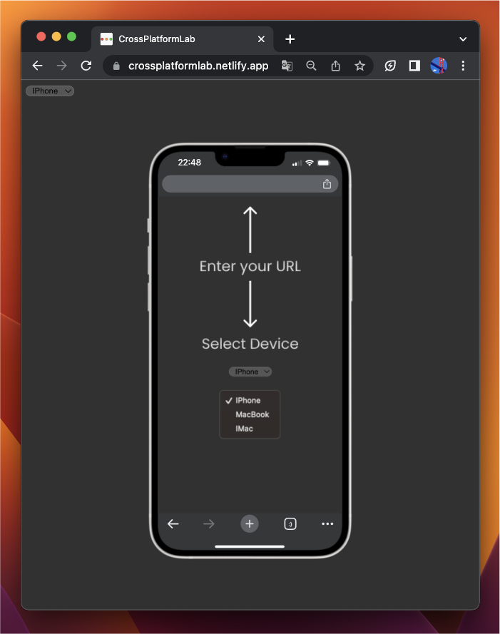

# Cross Platform Lab

Cross Platform Lab is an application that helps users visually display their developed websites, which are running locally on localhost, on devices such as the iPhone, MacBook, and iMac. With this app, you can quickly check how your website behaves on different platforms without manually testing it each time.

## Features

- Supports displaying websites on different devices: iPhone, MacBook, and iMac.
- Easy setup to connect with your local development environment (e.g., localhost:4200).
- Intuitive interface for navigating through different pages and showcasing interactions.

## Screenshots

## Setup

To get started with Cross Platform Lab, you can clone the repository to your local machine using Git HTTP. Follow these steps:

1. Open your terminal.
2. Change the current working directory to the location where you want the cloned directory to be created.
3. Run the following command to clone the repository:
 - git clone https://github.com/ItzNicDev/PhoneSim.git
4. In Order to start the app change the directory to the app via "cd app"
5. Start the app with "ng serve" or "npm start"

## Usage

1. Launch the application on your local device.
2. Select the desired device (iPhone, MacBook, or iMac).
3. Enter the URL of your developed website (e.g., `localhost:4200`).
4. Click "Display" to visually showcase your website.

## Contributors

- Niclas Pirkl [@itznicdev](https://github.com/itznicdev)

We welcome contributions from developers! If you've found a bug or would like to propose an improvement, please create an issue or a pull request.
